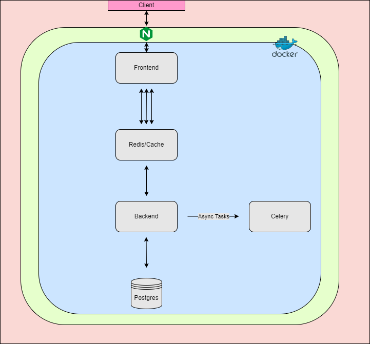

# Domain Name System

- [How it works](#how-it-works)
    - [DNS](#dns)
    - [Reverse Proxy](#reverse-proxy)
    - [Forward Proxy](#forward-proxy)
- [Working example](#working-example)
    - [Prerequisites](#prerequisites)
    - [Docker](#docker)
- [More examples](#more-examples)
- [Security](#security)
- [Resources](#resources)



# How it works

So you can easily learn it off some AI tool but i'm not doing this for you, i'm doing this for me. 

## DNS

Whats in a Domain? Well [google.com](www.google.com) is a domain.topleveldomain. So the domain is `google` and the top level domain is `www`. [subsearch.google.com](#) contains the subdomain `subsearch`. Behind any of these FQDNs (which may also be treated as Universal Resource Locators - URLs) are IP addresses. Domains are human readable fronts for these IP addresses. IP addresses are `X.X.X.X:port`. DNS exists so humans can type out words, or more importantly **brands** instead of `45.62.3.124:80`. 

Whats more, say Google have more than one IP that can host their search engine at the eponymous address. Well they can switch the DNS over to another IP and Joe Schlomo won't know what happened. 

You can do this locally. Your own computer (likely) will be able to host `localhost` through your `/etc/hosts` file. So you can spoof Facebook on your own machine and host your *next killer app* locally with a **brand** name. 

In other situations you may dynamically provision many nodes or addresses and want each machine to have a subdomain and such automatically added. Things like `coreDNS` in kubernetes take care of this. We can achieve similar setups in a Docker environment with a DNS solution like `dnsmasq`.

## Reverse Proxy

A reverse proxy is used to protect servers. A reverse proxy is a server that accepts a request from a client, forwards the request to another one of many other servers, and returns the results from the server that actually processed the request to the client as if the proxy server had processed the request itself. The client only communicates directly with the reverse proxy server and it does not know that some other server actually processed its request.

## Forward Proxy

A proxy server, sometimes referred to as a forward proxy, is a server that routes traffic between client(s) and another system, usually external to the network. By doing so, it can regulate traffic according to preset policies, convert and mask client IP addresses, enforce security protocols, and block unknown traffic.

# Working example
## Prerequisites

We already have the images locally (or if not, just pull them from your docker repo) so we'll go with a slightly edited version of the compose yaml; removing the mapped volumes. So with `docker-compose up --no-build` we should have what we need. 

<span style="color: red;">**BUG:** </span> I had to run these commands after `docker-compose up --no-build`: `docker exec <image-id> python manage.py migrate && docker exec <image-id>  python manage.py migrate --run-syncdb`. I think it's that while the backend depends on the db to be ready, application-wise it may not have been and thus, couldn't migrate the models. 

## Docker

We'll change our compose file to now specifically name the Docker network we'll use, `web`. `external: false` is not necessary here, it's the default setting. It means if we're not using an 'outside' network, we're having Docker make its own called web. 

1. Add a reverse proxy

We'll discuss this in another repo, but we'll add the following to our compose and include the `conf.d` file also.
```
  proxy:
    image: nginx
    container_name: nginx-test
    ports:
      - "80:80"
    volumes:
      - "./nginx.conf:/etc/nginx/nginx.conf"
    networks:
      - web
    depends_on:
      - redis
      - backend
      - frontend
      - db
      - celery
```
2. Include the configuration we need to expose our `frontend` on to the `http://frontend` domain.
```
events {
    worker_connections 1024;  # You can adjust this value as needed
}

http {
    server {
        listen 80;
        server_name MONC-DFLAN2.bdo.ca;
        location / {
            root /usr/share/nginx/html;
            index index.html index.htm;
        }
    }

    server {
        listen 80;
        server_name frontend;

        location / {
            proxy_pass http://frontend:3000;
            proxy_set_header Host $host;
            proxy_set_header X-Real-IP $remote_addr;
            proxy_set_header X-Forwarded-For $proxy_add_x_forwarded_for;
            proxy_set_header X-Forwarded-Proto $scheme;
        }
    }
}
```
3. Add a new host to your local DNS solution, `/etc/hosts`:
```
sudo vi /etc/hosts
#
127.0.0.1   frontend
```
4. Testing it out works well:
`curl localhost `
This will give you the default page for nginx server. Here, we use nginx as a reverse proxy. That is, it accepts requests on our desired domain and forwards those to the IP - or in this case the docker service name - to respond to. 

Key here is the use of our own network to let us use Dockers in-built DNS solution. Notice the names of the services in the compose file also work as DNS names. This allows us to use the line proxy_pass `http://frontend:3000;` in our `nginx.conf` to tell the proxy to redirect requests to frontend to this service. 

```
curl frontend
nginx-test  | 10.0.0.1 - - [30/Oct/2024:17:59:41 +0000] "GET / HTTP/1.1" 200 1754 "-" "curl/7.81.0"
```

# More examples

One thing I really wanted to get working was a dynamic DNS resolver. I couldn't get it to work on mac (I think because macos Docker Desktop works as a VM) or WSL2 (because it's windows). I think it would have worked easier on Ubuntu as you can reach IP's from docker directly in Ubuntu (with the bridge or host network if i'm not mistaken). 

That would have involved the use of the in-built DNS `resolvd.service` on that OS but I would have tried to get it to work with `CoreDNS` as configuration of that seems more straightforward. But alas so little time. 

Many non-local DNS solutions will advise pointing resolvers to well known services like Google for performance reasons:

```
The biggest reason that users switch to using Google DNS is just that: performance. The speed and reliability is generally better with a public DNS like Google's rather than your default DNS servers.
```
So depending if your workloads are in-house or pointing outward, that kind of thing is advised. 

# Security

Most important for a reverse proxy is to set up and use SSL. This would mean exposing port 443 in addition to the 80. We would also want to redirect any requests to 80 (just http protocol) to 443 (enforcing https). 

We would then have to manage the keys and certs for this server. 

Further, if we set up a forward proxy/proxy server for incoming traffice, we could set rate limiting, IP filtering there and protect the backend proxy from getting hit unnecessarily. 

# Resources

[Forward vs Reverse Proxy](https://www.strongdm.com/blog/difference-between-proxy-and-reverse-proxy#:~:text=A%20forward%20proxy%20deals%20with,of%20the%20server%27s%20direct%20involvement.)
[DNS Server on own machine](https://www.howtogeek.com/devops/how-to-run-your-own-dns-server-on-your-local-network/) <br>
[DNS Masq](https://boxblinkracer.com/blog/docker-dnsmasq)